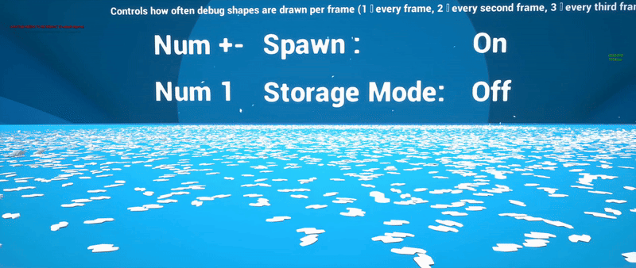

# PhysXInstancedSubsystem

**PhysX Instanced Subsystem** is an Unreal Engine plugin that provides a **world subsystem + instanced actor workflow** for managing **large amounts of PhysX-backed instanced bodies**.

Instead of spawning thousands of separate `AActor` / `UPrimitiveComponent` objects, you keep **one (or a few) instanced mesh actors** for rendering, while the subsystem creates and updates **per-instance PhysX rigid bodies** and writes their poses back into ISM/HISM-style instance transforms.

> **PhysX-only:** This plugin targets **UE4 PhysX** builds (`PHYSICS_INTERFACE_PHYSX`). Chaos builds are not supported.

**Current Version: 1.10**

**Changelog:** https://github.com/Dragomirson/PhysXInstancedSubsystem/wiki/Changelog
***

## Documentation (Wiki)

Full documentation lives here: https://github.com/Dragomirson/PhysXInstancedSubsystem/wiki/Documentation

***

## Highlights

- **World Subsystem ownership** (`UPhysXInstancedWorldSubsystem`) for global instance tracking and sync.
- **Instanced actor workflow** (`APhysXInstancedMeshActor`) for editor-friendly setup and Blueprint usage.
- **Stable instance handles** (`FPhysXInstanceID`) for gameplay-safe references (avoid fragile indices).
- **High-level spawn API** (`SpawnPhysicsInstance`, `SpawnPhysicsInstanceFromActor`) + batch spawn support.
- **Batch registration** with optional multithreading for heavy scenes.
- **Storage mode**: move “rested” bodies out of active physics while keeping visuals + collision.
- **Debug & profiling**:
  - `stat PhysXInstanced`
  - PhysX shape debug draw via CVars (`physx.Instanced.DebugDraw`, etc.)

***

## Demos / Stress Tests

### 20K+ Physics Bodies (Plugin v1.01 demo)

**Context:** This video was recorded on **plugin version 1.01** (not the latest).  
Since then, the plugin received multiple improvements, including additional multithreading and pipeline updates — a new video is planned.

**Post text (original):**  
> 20K+ physics bodies, convex collision and 60+ FPS on a Ryzen 7 3800X: still not even close to the limit  
> I’ve been pushing PhysX pretty hard lately and wanted to see where the hardware actually starts to choke.  
> Ryzen 7 3800X, convex collision, Development build — and in this video I’m holding a stable 60+ FPS with a level of physics where most scenes would already be on their knees.  
> By the way, all those metal parts and debris you see flying around aren’t just test junk — they’re some of the actual assets you’ll run into in our game **Asgard's Edda**. So this is real production content under real stress.  
> In the second part of the video I switch on my storage mode — a mode where instances are kicked out of active physics and all the heavy components, keeping only minimal state (transform, ID, a few flags). In practice, the objects are “parked”: you can keep thousands of them almost for free and wake them back into simulation instantly whenever you need.  
> And the fun part is: this is still far from the ceiling. There are plenty of growth points left in the system — from spawn pipeline optimizations to smarter batching and memory usage. So next up: even heavier scenes and even more shameless experiments with PhysX.

**Links**
- **Video:** *([Watch](https://youtu.be/G3Ksz0WWk3Y?si=0G6tzRk7QhlPQ7ll))*

  
  
- **Download build (try it yourself):** [Google Drive](https://drive.google.com/file/d/1NulunBP2Qre5vLyYnkiqywovsycNuWdQ/view)

***

## Getting Started

1. Install the plugin into:
   - `YourProject/Plugins/PhysXInstancedSubsystem/`
2. Enable it in **Edit → Plugins**, restart the editor.
3. Follow the Wiki documentation (recommended):
   - https://github.com/Dragomirson/PhysXInstancedSubsystem/wiki/Documentation

***

## Attribution

If you distribute this project or derivative works, you must retain the contents of the `NOTICE` file.

***

## Marketing / Promotional materials (request)

If you mention this software in marketing or promotional materials, please include:
- **NordVader Inc.**
- [FAB](https://www.fab.com/sellers/NordVader%20Inc.)
- https://github.com/Dragomirson/PhysXInstancedSubsystem
